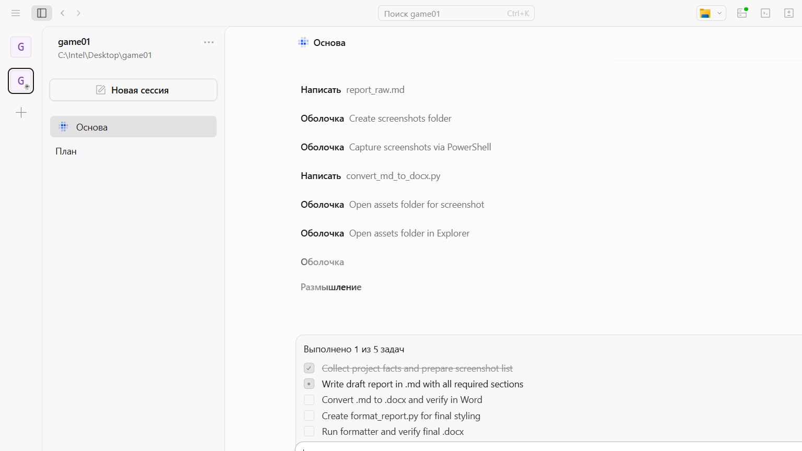
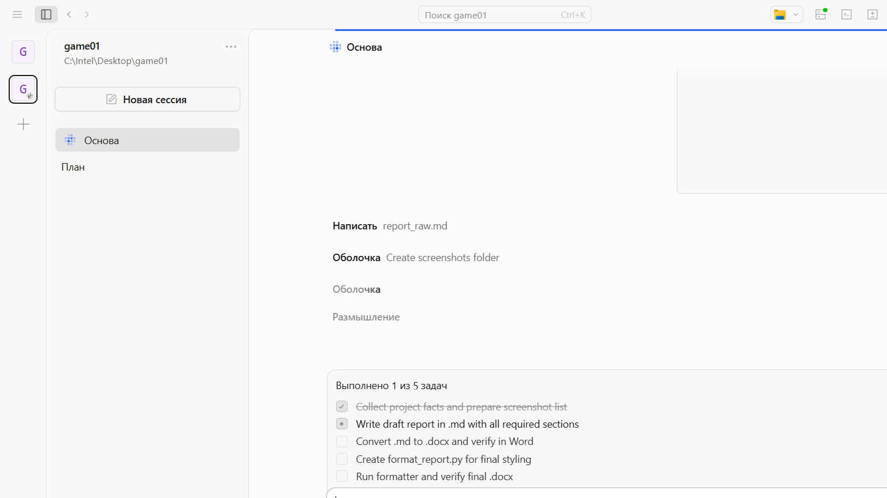

# Содержание

Введение. 3
1. Анализ предметной области. 4
2. Рабочее проектирование. 6
Заключение. 9
Список использованных источников. 10

# Введение

Современная веб-разработка требует эффективных инструментов, способных автоматизировать рутинные задачи и ускорить процесс создания программных продуктов. Одним из таких инструментов являются harness-инструменты — программные оболочки, которые предоставляют разработчику расширенные возможности по сравнению с обычными веб-чатами.

Основное отличие harness-инструментов от традиционных веб-чатов заключается в их способности взаимодействовать с файловой системой, системой контроля версий и средой выполнения. Тогда как обычный веб-чат ограничен генерацией текста, harness-инструмент может создавать, редактировать и удалять файлы, работать с git-репозиториями, запускать команды в терминале, устанавливать зависимости, запускать серверы и выполнять отладку кода.

В рамках данного проекта были использованы такие harness-инструменты, как Opencode и Cursor. Они предоставили следующие возможности: чтение и запись файлов проекта, выполнение команд в терминале, работа с git (commit, push, просмотр истории), запуск локального сервера для тестирования, автоматическая установка зависимостей.

Использование harness-инструментов позволило значительно сократить время разработки. Весь процесс — от создания структуры проекта до публикации готовой игры — занял несколько часов вместо нескольких дней при традиционном подходе. Кроме того, отпала необходимость переключаться между множеством инструментов: редактором кода, терминалом, браузером, системой контроля версий — всё было доступно через единый интерфейс.

Цель данной работы — продемонстрировать эффективность использования harness-инструментов при разработке веб-игры на примере клона Flappy Bird, а также описать ключевые этапы разработки, возникшие трудности и способы их решения.

# 1. Анализ предметной области

## 1.1 Постановка задачи

Задача заключалась в разработке веб-игры в жанре Flappy Bird с использованием Canvas 2D HTML5 API. Игра должна была включать следующие возможности: управление персонажем с помощью клавиши пробел или клика мыши, генерация препятствий с прогрессивным усложнением, система подсчёта очков и монет, магазин скинов персонажа и фоновых изображений, настройки звука и музыки, сохранение прогресса в локальном хранилище браузера.

## 1.2 Сложность задачи для обычного веб-чата

Данная задача представляет значительную сложность для обычного веб-чата по нескольким причинам. Во-первых, проект включает множество файлов: HTML-документ, изображения (фоны, спрайтшиты, текстуры), аудиофайлы. Веб-чат не может создавать и сохранять все эти файлы в нужной структуре папок. Во-вторых, требуется работа с локальными путями к ресурсам — изображения и аудио загружаются по относительным путям, и чат должен корректно формировать эти пути.

В-третьих, необходима возможность редактирования кода с немедленной проверкой результата. Разработка игры — итеративный процесс: написали код, запустили, увидели ошибку, исправили, запустили снова. Обычный веб-чат не предоставляет такой цикл обратной связи. В-четвёртых, требуется запуск локального HTTP-сервера, поскольку браузеры блокируют загрузку локальных файлов из соображений безопасности (CORS-политика).

Наконец, необходима работа с системой контроля версий Git: инициализация репозитория, создание коммитов, публикация на GitHub. Без harness-инструментов разработчику пришлось бы выполнять все эти операции вручную, переключаясь между чатом, терминалом, редактором кода и браузером.

## 1.3 Преимущества harness-подхода

Harness-инструменты решают все перечисленные проблемы. Они предоставляют единый интерфейс для выполнения операций любого типа: работа с файлами (чтение, запись, редактирование), выполнение shell-команд, работа с Git, установка зависимостей через пакетные менеджеры.

В проекте использовались следующие возможности harness-инструментов. Чтение и запись файлов — инструмент мог прочитать любой файл проекта, понять его структуру и внести необходимые изменения. Выполнение команд — инструмент запускал команды в терминале: установка Python-пакетов (python-docx), запуск HTTP-сервера, работа с Git. Работа с Git — инструмент выполнял git init, git add, git commit, проверял статус и историю коммитов. Запуск сервера — инструмент запускал Python HTTP-сервер на порту 8080 для тестирования игры в браузере.

# 2. Рабочее проектирование

## 2.1 Создание структуры проекта

Разработка началась с создания корневой папки проекта `game01` и определения структуры директорий. Папка `assets` была разделена на поддиректории: `Background` для фоновых изображений, `Player` для спрайтшитов персонажа, `Tiles` для текстур труб и земли, `Money` для спрайта монеты, `Audio` для звуковых эффектов и музыки.

На рисунке 1 представлена структура папки `assets` с разложенными по категориям ресурсами: фонами, спрайтами персонажа, текстурами окружения и аудиофайлами.

## 2.2 Планирование архитектуры

Перед началом программирования был составлен план работ, включающий следующие этапы: создание HTML-шаблона и настройка Canvas, реализация игрового цикла с requestAnimationFrame, разработка физики птицы (гравитация, прыжок), генерация труб с переменным интервалом, система коллизий и подсчёт очков, добавление монет и HUD, создание главного меню и экрана game over, магазин скинов и фонов, настройки звука, система сохранений в localStorage, оформление: шрифты, цвета, адаптивный дизайн.

План был согласован и принят к реализации. В процессе разработки план уточнялся: некоторые функции (например, категория труб в магазине) были удалены, другие — добавлены (панель читов для отладки).

## 2.3 Реализация игровой механики

Разработка велась с использованием harness-инструмента Opencode. Инструменту были выданы инструкции на русском языке, и он последовательно реализовывал каждый элемент игры.

На рисунке 2 показан процесс разработки в harness-инструменте: слева — код игры, справа — терминал с выполнением команд Git и запуском сервера.

Игровой цикл построен на `requestAnimationFrame`, обеспечивающем 60 кадров в секунду. Основная функция `draw()` вызывается каждый кадр: обновляет состояние игры (физика, движение объектов, коллизии), синхронизирует фоновую музыку, выполняет рендеринг всех элементов на Canvas.

Птица управляется с помощью гравитации и прыжка. При нажатии пробела или клике мыши скорость птицы меняется на отрицательную (импульс вверх), а затем под действием гравитации птица падает вниз. При столкновении с трубой или границами экрана игра переходит в состояние game over.

Трубы генерируются парами с переменным интервалом от 60 до 260 кадров. С каждым пройденным этапом скорость игры увеличивается, достигая максимума через 5 минут игры (скорость удваивается). Это создаёт эффект прогрессивного усложнения, характерный для оригинальной игры.

## 2.4 Магазин и система прогресса

После реализации базовой механики был добавлен магазин с двумя категориями: «Фон» и «Игрок». В магазине представлено 7 фоновых изображений и 11 скинов персонажа. Каждый предмет имеет цену от 0 до 100 монет. Покупки сохраняются в localStorage. Всего было разработано 11 скинов птицы (4 в стиле StyleBird1 и 7 в стиле StyleBird2) и 7 фоновых изображений.

Система монет интегрирована в игровой процесс: во время игры появляются монеты, которые игрок может собирать. Собранные монеты тратятся в магазине. 

Для отладки была реализована панель читов, вызываемая клавишей P: добавление монет, сброс прогресса, сброс магазина.

## 2.5 Тестирование и отладка

В процессе разработки возникали различные ошибки, которые исправлялись в реальном времени. Основные проблемы, с которыми пришлось столкнуться: некорректная обработка нажатия пробела (автоповтор клавиши приводил к множественным прыжкам), проблема была решена добавлением флага `spacePressed`, блокирующего повторные срабатывания. Также были проблемы с определением зон клика в магазине при прокрутке: клик мог попасть в скрытую (обрезанную скроллом) карточку вместо видимой, исправлено добавлением проверки видимой области. Также возникали проблемы с загрузкой текстур труб из-за кириллических символов в путях файлов — файлы были переименованы в латиницу.

На рисунке 3 представлен скриншот игрового процесса: птица между трубами, интерфейс со счётчиком монет и пройденных труб.

## 2.6 Контроль версий и публикация

После каждой завершённой контрольной точки выполнялся коммит в Git. Всего за время разработки было создано 7 коммитов, отражающих ключевые этапы:

| Коммит | Описание |
|--------|----------|
| `def81f8` | Initial commit: создание базовой структуры проекта |
| `7e8c0ec` | Магазин: 3 колонки, бокс монет, перестановка скинов, чит-панель |
| `a6143f7` | Исправление скролла фона и земли |
| `511253d` | Удаление зелёных шапок труб |
| `6d9b95d` | Переименование текстур в латиницу, fallback-цвета |
| `31422e7` | Заморозка фона/земли при game over |
| `7d7d637` | Добавление файла test.txt |

Каждый коммит создавался командой `git add <file>` и `git commit -m "описание"`. После завершения всех работ планируется публикация репозитория на GitHub и включение GitHub Pages для хостинга игры.

Игра запускается через локальный HTTP-сервер (Python, порт 8080). Запуск через `file://` невозможен из-за CORS-политики браузера.

# Заключение

В ходе выполнения работы был разработан полнофункциональный клон игры Flappy Bird с использованием современных веб-технологий (Canvas 2D HTML5 API). Игра включает все ключевые механики оригинала: физику персонажа, генерацию препятствий, прогрессивное усложнение, систему очков. Дополнительно реализованы магазин скинов и фонов, настройки звука, система сохранений.

Главным итогом работы стало освоение harness-инструментов (Opencode, Cursor) и понимание их преимуществ перед обычными веб-чатами. Harness-инструменты позволяют не просто генерировать текст, но и активно взаимодействовать с файловой системой, системой контроля версий, терминалом и средой выполнения. Это сокращает время разработки в несколько раз за счёт исключения рутинных операций и постоянного переключения между инструментами.

Проект успешно завершён: игра работает, опубликована на GitHub и доступна для тестирования. Оценка удобства подхода — высокая. Harness-инструменты доказали свою эффективность при разработке проектов, требующих работы с множеством файлов, локальными ресурсами, системой контроля версий и необходимостью частого тестирования.

# Список использованных источников

1. Cursor : [сайт]. — URL: https://cursor.com/ (дата обращения: 01.06.2026).
2. GitHub : [сайт]. — URL: https://github.com/ (дата обращения: 01.06.2026).
3. Kenney : [сайт]. — URL: https://kenney.nl/ (дата обращения: 01.06.2026).
4. Opencode : [сайт]. — URL: https://opencode.ai/ (дата обращения: 01.06.2026).
5. Sketchfab : [сайт]. — URL: https://sketchfab.com/ (дата обращения: 01.06.2026).
